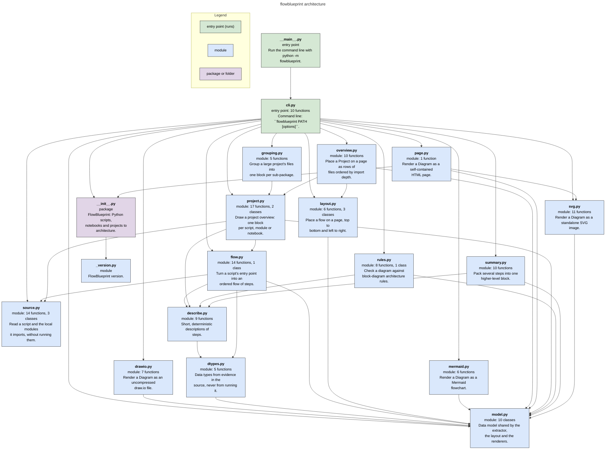

# flowblueprint architecture

Architecture generated by FlowBlueprint from the source code, without running it.

```mermaid
---
title: "flowblueprint architecture"
---
flowchart TD
    n1["<b>__main__.py</b><br/>entry point<br/>Run the command line with python -m<br/>flowblueprint."]:::module1
    n2["<b>cli.py</b><br/>entry point: 10 functions<br/>Command line: #96;#96;flowblueprint PATH<br/>[options]#96;#96;."]:::module1
    n3["<b>drawio.py</b><br/>module: 7 functions<br/>Render a Diagram as an uncompressed<br/>draw.io file."]:::module2
    n4["<b>grouping.py</b><br/>module: 5 functions<br/>Group a large project's files into<br/>one block per sub-package."]:::module2
    n5["<b>mermaid.py</b><br/>module: 6 functions<br/>Render a Diagram as a Mermaid<br/>flowchart."]:::module2
    n6["<b>overview.py</b><br/>module: 10 functions<br/>Place a Project on a page as rows of<br/>files ordered by import depth."]:::module2
    n7["<b>page.py</b><br/>module: 1 function<br/>Render a Diagram as a self-contained<br/>HTML page."]:::module2
    n8["<b>rules.py</b><br/>module: 8 functions, 1 class<br/>Check a diagram against<br/>block-diagram architecture rules."]:::module2
    n9["<b>summary.py</b><br/>module: 10 functions<br/>Pack several steps into one<br/>higher-level block."]:::module2
    n10["<b>project.py</b><br/>module: 17 functions, 2 classes<br/>Draw a project overview: one block<br/>per script, module or notebook."]:::module2
    n11["<b>layout.py</b><br/>module: 6 functions, 3 classes<br/>Place a flow on a page, top to<br/>bottom and left to right."]:::module2
    n12["<b>__init__.py</b><br/>package<br/>FlowBlueprint: Python scripts,<br/>notebooks and projects to<br/>architecture."]:::module3
    n13["<b>svg.py</b><br/>module: 11 functions<br/>Render a Diagram as a standalone SVG<br/>image."]:::module2
    n14["<b>flow.py</b><br/>module: 14 functions, 1 class<br/>Turn a script's entry point into an<br/>ordered flow of steps."]:::module2
    n15["<b>_version.py</b><br/>module<br/>FlowBlueprint version."]:::module2
    n16["<b>source.py</b><br/>module: 14 functions, 3 classes<br/>Read a script and the local modules<br/>it imports, without running them."]:::module2
    n17["<b>describe.py</b><br/>module: 9 functions<br/>Short, deterministic descriptions of<br/>steps."]:::module2
    n18["<b>dtypes.py</b><br/>module: 5 functions<br/>Data types from evidence in the<br/>source, never from running it."]:::module2
    n19["<b>model.py</b><br/>module: 10 classes<br/>Data model shared by the extractor,<br/>the layout and the renderers."]:::module2
    n12 --> n15
    n1 --> n2
    n2 --> n12
    n2 --> n3
    n2 --> n14
    n2 --> n11
    n2 --> n4
    n2 --> n5
    n2 --> n19
    n2 --> n6
    n2 --> n7
    n2 --> n10
    n2 --> n8
    n2 --> n16
    n2 --> n13
    n2 --> n9
    n17 --> n18
    n3 --> n19
    n18 --> n19
    n14 --> n17
    n14 --> n18
    n14 --> n19
    n14 --> n16
    n4 --> n10
    n11 --> n19
    n5 --> n19
    n6 --> n11
    n6 --> n19
    n6 --> n10
    n7 --> n12
    n7 --> n19
    n7 --> n13
    n10 --> n17
    n10 --> n14
    n10 --> n19
    n10 --> n16
    n8 --> n17
    n8 --> n19
    n9 --> n17
    n9 --> n19
    n13 --> n19
    subgraph legend["Legend"]
        legend1["entry point (runs)"]:::module1
        legend2["module"]:::module2
        legend3["package or folder"]:::module3
    end
    classDef module1 fill:#d5e8d4,stroke:#222222,color:#000000
    classDef module2 fill:#dae8fc,stroke:#222222,color:#000000
    classDef module3 fill:#e1d5e7,stroke:#222222,color:#000000
```
