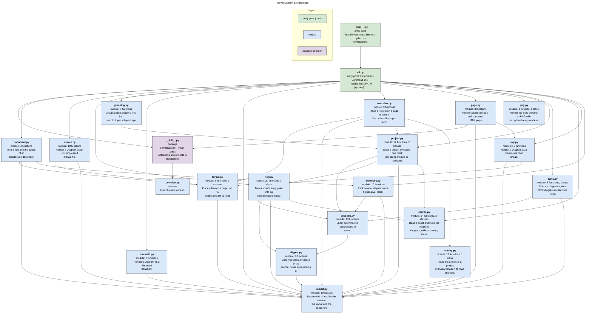
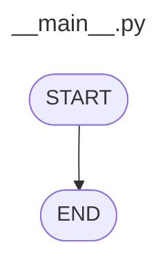
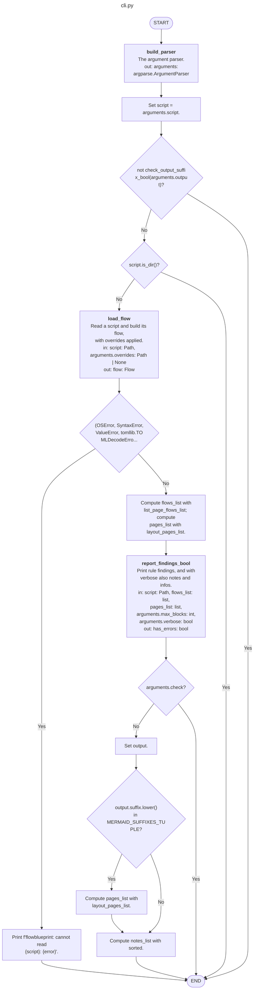
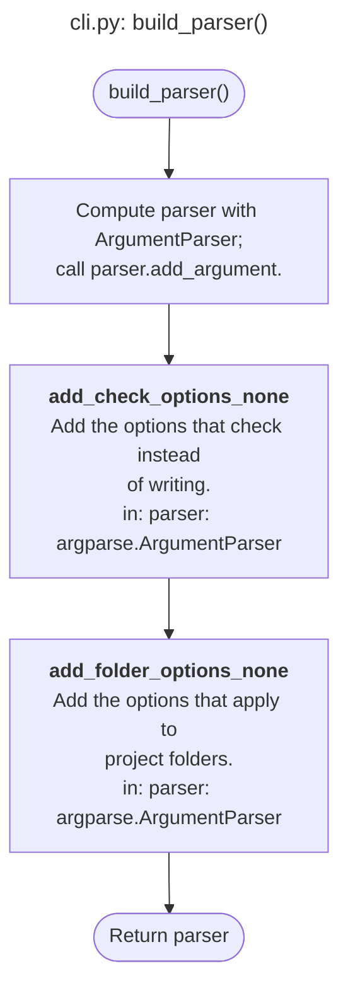
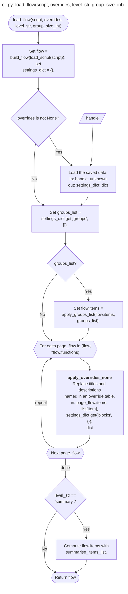
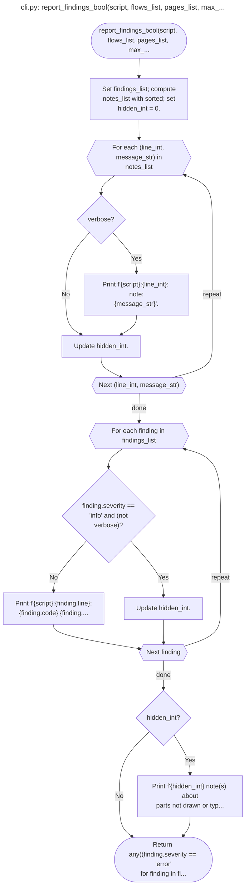
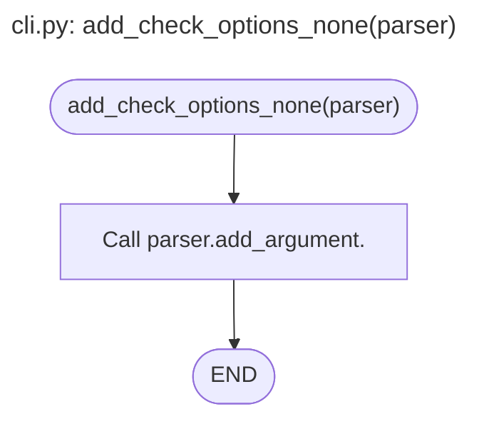
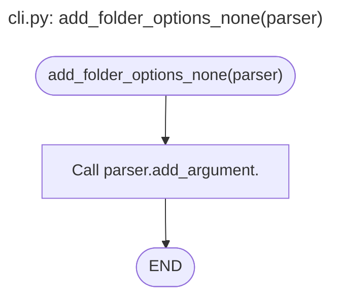
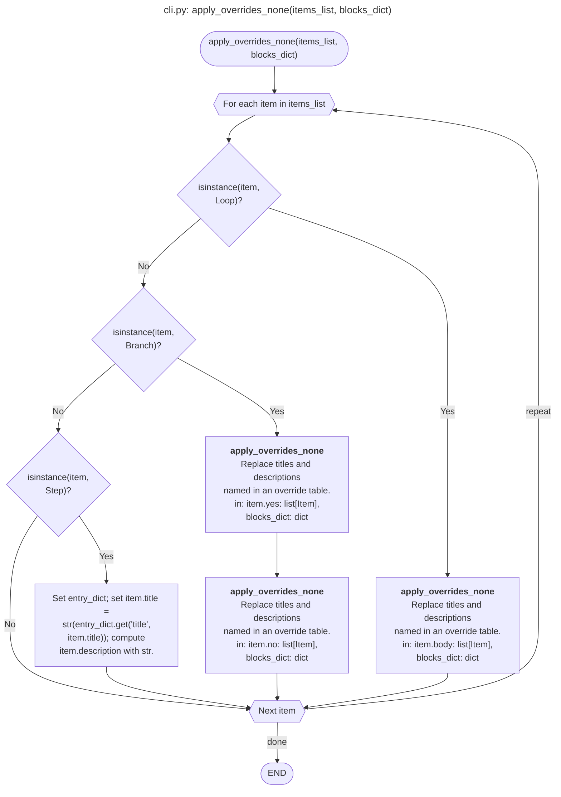

# flowblueprint architecture

Architecture generated by FlowBlueprint from the source code, without running it.

## flowblueprint architecture

## __main__.py

## cli.py

## cli.py: build_parser()

## cli.py: load_flow(script, overrides, level_str, group_size_int)

## cli.py: report_findings_bool(script, flows_list, pages_list, max_...

## cli.py: add_check_options_none(parser)

## cli.py: add_folder_options_none(parser)

## cli.py: apply_overrides_none(items_list, blocks_dict)

