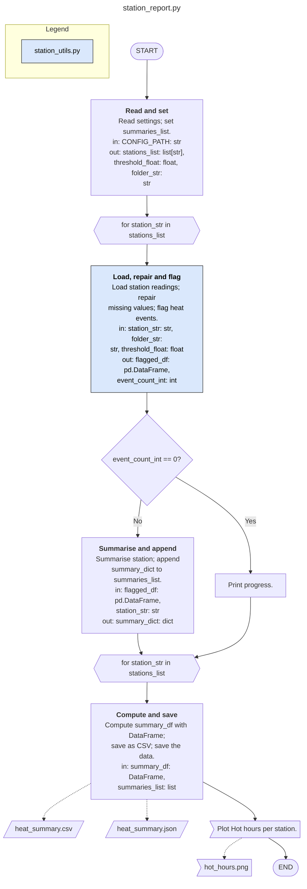

# FlowBlueprint

[](https://github.com/SAMtheROCKET/flowblueprint/actions/workflows/ci.yml)
[](https://pypi.org/project/flowblueprint/)
[](https://pypi.org/project/flowblueprint/)
[](LICENSE)
[](https://samtherocket.github.io/flowblueprint/)
[](https://marketplace.visualstudio.com/items?itemName=samtherocket.flowblueprint)

**The Python architect: turn any Python script, Jupyter notebook or whole
project folder into a clear architecture diagram (draw.io, SVG, HTML or
Mermaid for your README), without running it.**

Website: [samtherocket.github.io/flowblueprint](https://samtherocket.github.io/flowblueprint/)

FlowBlueprint reads your code and draws how it flows: what runs first,
which functions are called, what goes in and out of each step (with data
types), where loops and decisions are, which files, databases and storage
are read or written, and where plots are made. Managers, product owners
and new team members can understand a pipeline before reading a single
line of code; developers get an architecture diagram that stays in step
with the source.

Part of a family of standalone Python tools:
[FuncLoom](https://github.com/SAMtheROCKET/funcloom) (functionizer),
[RefacTrail](https://github.com/SAMtheROCKET/refactrail) (refactorizer)
and FlowBlueprint (architect).


**Status:** alpha, version 0.2.1a0 on PyPI. Free and open source (MIT).
Works offline: no AI model, account or internet connection needed.

## Start in one minute

1. **Install** (needs Python 3.12 or newer;
   [older Python? see below](#your-project-uses-an-older-python)):

   ```bash
   pip install flowblueprint
   ```

2. **Draw your script, notebook or whole project:**

   ```bash
   flowblueprint my_script.py                  # writes my_script.drawio
   flowblueprint my_notebook.ipynb -o flow.svg # an image for slides
   flowblueprint my_project/ -o ARCHITECTURE.md  # renders on GitHub
   ```

3. **Open the result.** `.drawio` opens (and stays editable) in
   [diagrams.net](https://app.diagrams.net) or VS Code's *Draw.io
   Integration* extension; `.svg` and `.html` open in any browser; `.md`
   shows the diagram on GitHub and GitLab. Your code is never run or
   changed.


Too many blocks? Add `--level summary` for a higher-level picture.
`pip install flowblueprint` also installs FuncLoom and RefacTrail.

## In VS Code

1. Install **[FlowBlueprint](https://marketplace.visualstudio.com/items?itemName=samtherocket.flowblueprint)** from the
   Extensions view (search *FlowBlueprint*).
2. **Right-click** a `.py` file, a notebook or a folder in the Explorer
   and choose **Draw architecture of this file** (or **of this project**).
   The Command Palette (**Ctrl+Shift+P**, type **FlowBlueprint**) works
   too.
3. Pick a format (`.drawio`, `.svg`, `.html` or `.md`). The diagram is
   saved next to your file (`architecture.<format>` for a folder) and
   opens straight away. The first time, click **Install** when asked.

## What's new in 0.2.1a0

- **New VS Code extension** on the Marketplace: right-click to draw a
  file or a whole project.
- **Older-Python projects:** a step-by-step
  [guide](https://github.com/SAMtheROCKET/flowblueprint/blob/main/docs/OLDER_PYTHON.md), tested with code for Python 3.8, 3.9 and
  3.10.
- **A simpler README.** Drawing is unchanged; 0.2.0a0's project
  overviews, Mermaid and HTML output are in the [changelog](https://github.com/SAMtheROCKET/flowblueprint/blob/main/CHANGELOG.md).

## Your project uses an older Python?

No problem. FlowBlueprint only **reads** your code, so it runs on its own
Python 3.12 or newer while your project stays on Python 3.8, 3.9, 3.10 or
3.11. Do this once:

1. **Make a separate Python for the tools** (no admin rights needed):

   ```bash
   # Windows (Command Prompt)
   py -3.12 -m venv %USERPROFILE%\py-tools
   %USERPROFILE%\py-tools\Scripts\python -m pip install flowblueprint

   # macOS / Linux
   python3.12 -m venv ~/py-tools
   ~/py-tools/bin/python -m pip install flowblueprint
   ```

   No Python 3.12 on the machine? Run `pip install uv`, then
   `uvx --python 3.12 flowblueprint my_script.py`: uv downloads Python 3.12 for you.

2. **Run FlowBlueprint with that Python:**

   ```bash
   %USERPROFILE%\py-tools\Scripts\python -m flowblueprint my_script.py     # Windows
   ~/py-tools/bin/python -m flowblueprint my_script.py                       # macOS / Linux
   ```

3. **In VS Code**, open Settings, search for `flowblueprint.pythonPath` and paste
   the path of that Python (for example
   `C:\Users\YOU\py-tools\Scripts\python.exe`).

Your project keeps using its own Python to run. More detail, limits and
fixes for common errors: [the older-Python guide](https://github.com/SAMtheROCKET/flowblueprint/blob/main/docs/OLDER_PYTHON.md).

If `pip install flowblueprint` says `from versions: none`, your Python is older
than 3.12 (use the steps above) or your company's package mirror does not
carry it yet (ask IT to allow it).

## Output formats

The suffix of `-o` picks the format:

| Suffix | You get | Good for |
| --- | --- | --- |
| `.drawio` (default) | An editable diagram | diagrams.net, the VS Code Draw.io extension |
| `.svg` | An image | Slides, documents, READMEs |
| `.html` | A self-contained web page with the image and notes | E-mail, tickets, sharing without tools |
| `.md` | Markdown with a Mermaid flowchart | GitHub and GitLab READMEs, wikis, Obsidian |
| `.mmd` | Mermaid text | Notion, documentation sites, Mermaid tools |

A Mermaid diagram lives in your repository as text and GitHub draws it.
This one is `flowblueprint station_report.py --level summary -o FLOW.md`:



## Whole projects


Point FlowBlueprint at a folder to see the whole project: one block per
script, module, package and notebook, with an arrow from each file to
the project files it imports. Entry points sit at the top and the
modules they rely on below them. Each block says what the file is (its
docstring, the steps it runs, or the functions it provides), how many
functions and classes it defines, and which files, databases and
storage it reads and writes.

```bash
flowblueprint my_project/                        # my_project/architecture.drawio
flowblueprint my_project/ -o ARCHITECTURE.md     # Mermaid for the README
flowblueprint my_project/ --include-tests -o overview.html
```


Large projects stay readable: above 40 files, files are grouped into one
block per sub-package (the deepest folder level that fits 40 blocks),
each summing its files, functions, classes and data and naming the
scripts it runs. `--group-depth 2` picks the level yourself;
`--group-depth 0` draws every file.

Absolute, relative and sibling-script imports are resolved, including
`src` layouts and folders inside packages. Virtual environments,
caches, build output and hidden folders are skipped; test files are
skipped unless you pass `--include-tests`. Files that cannot be parsed
are listed as notes instead of stopping the run. In the draw.io and SVG
output, an arrow that skips rows runs in its own lane beside the blocks,
so it never passes behind one; the Mermaid output is laid out by Mermaid
itself.

## What you get

| In your code | In the diagram |
| --- | --- |
| The script or notebook name | A title above the flow |
| Start and end of the run | START and END terminators |
| A call to your own function or method | A block: **name**, one-line description, `in:` and `out:` with data types |
| Several small operations | One plain block, or one packed block at `--level summary` |
| Functions from your own modules | Coloured blocks, with a colour legend per module |
| `for` / `while` loops | Opening and closing loop-limit shapes |
| Notebook Markdown headings, `# %% Title` cell markers | Dashed section banners that split the flow |
| `if` / `elif` / `else` | A decision diamond with Yes and No paths |
| `continue`, `break`, `return` in a branch | An arrow to the loop end, past the loop, or to END |
| CSV, Parquet, Excel, JSON, config files | Data shapes on the left (read) or right (written) |
| SQL reads and writes | Database cylinders |
| `s3://`, `gs://`, network shares | Storage shapes |
| matplotlib, seaborn, plotly | A plot block, with saved figures as documents |
| Long flows | Columns of at most 10 blocks joined by A/B connectors |

Descriptions come from docstrings. Without one, FlowBlueprint writes a
short, deterministic description from the code itself ("Calculate
distance." for `calculate_distance`). Types come from annotations,
well-known library calls, literals and naming conventions such as `_df`
or `_list`; anything else is shown as `unknown` rather than guessed.

## Two levels: detailed and summary

One function is not always one block. `--level detailed` (the default)
draws one block per call. `--level summary` packs consecutive operations
into higher-level blocks (up to `--group-size`, default 4), each listing
its operations with the inputs it needs and the outputs it leaves:


You choose the grouping when it matters, with an override file:

```toml
# blueprint.toml
[[groups]]
title = "prepare_readings"
description = "Load and clean the readings of one station."
functions = ["load_station_readings", "repair_missing_values"]

[blocks.flag_heat_events]
description = "Find the hours above the heat threshold."
```

```bash
flowblueprint station_report.py --overrides blueprint.toml
```

## Classes and well-structured code

FlowBlueprint works directly on any readable script; you do not need to
run FuncLoom or RefacTrail first. Classes are understood: `Pipeline(...)`
becomes a *Create the Pipeline* block, `pipeline.load()` resolves to the
method and its docstring, and when the entry point only hands over to one
method (`Pipeline(config).run()`), that method's steps are drawn.

FlowBlueprint's own [ARCHITECTURE.md](ARCHITECTURE.md) is drawn this way
(`flowblueprint src/flowblueprint -o ARCHITECTURE.md`).

## Keep the diagram up to date


In GitHub Actions, the FlowBlueprint action draws the diagram on every
push; commit it, or keep it as a build artifact:

```yaml
- uses: actions/checkout@v4
- uses: SAMtheROCKET/flowblueprint@main
  with:
    path: .                     # a script, notebook or folder
    output: ARCHITECTURE.md     # .md, .mmd, .drawio, .svg or .html
    args: --level summary       # optional extra options
- uses: actions/upload-artifact@v4
  with:
    name: architecture
    path: ARCHITECTURE.md
```

To fail a pull request when someone changed the code but not the
committed diagram, add `check: "true"`. Nothing is drawn; the step fails
when `ARCHITECTURE.md` is missing or out of date, and passes otherwise:

```yaml
- uses: SAMtheROCKET/flowblueprint@main
  with:
    output: ARCHITECTURE.md
    check: "true"
```

The same check on the command line is
`flowblueprint . -o ARCHITECTURE.md --up-to-date` (exit code 1 when
stale; line endings are ignored).

With [pre-commit](https://pre-commit.com), the
`flowblueprint-architecture` hook redraws `ARCHITECTURE.md` whenever
Python files or notebooks change (or use
`flowblueprint-architecture-check` to fail instead of redrawing):

```yaml
repos:
  - repo: https://github.com/SAMtheROCKET/flowblueprint
    rev: main
    hooks:
      - id: flowblueprint-architecture
```

## Checks

Every diagram is checked against block-diagram rules: start and end
terminators, the script name, closed loops, no open-ended blocks, data
sources on the left, the per-column limit, a legend for every colour, and
verb-first titles. `--check` only checks and exits with 1 on errors.
Statements that are not drawn (for example exception handlers) are
reported with their line numbers.

## Who uses it

- **Developers and data scientists**: document a pipeline, review a pull
  request, or explain a notebook to the team.
- **Managers, product owners and project managers**: see what a script
  does, step by step, before a review or planning meeting.
- **Students and teachers**: present coursework and assignments as a
  clear flowchart.
- **Teams taking over code**: get an architecture overview of unfamiliar
  scripts in seconds.

## Safety

The code is parsed with Python's own `ast` module and is never imported or
executed. The source file is never changed. Existing output files are not
overwritten unless you pass `--force`.

Robustness: every file of the Python 3.12 standard library (584 files) and
of a 6,988-file corpus of installed packages (NumPy, SciPy, SymPy,
matplotlib, Twisted and others) is drawn in detailed and summary form and
rendered as draw.io, SVG and Mermaid without an error, as are project
overviews of all 92 packages in that corpus (SymPy's 801 files and 6,404
imports take under 5 seconds).

## How it fits with FuncLoom and RefacTrail

FlowBlueprint installs FuncLoom and RefacTrail and uses them through
absolute imports (for example RefacTrail's validated notebook reader).
Use them together for one flow: **FuncLoom** turns long scripts and
notebooks into functions and modules, **RefacTrail** checks, formats and
refactors them, and **FlowBlueprint** draws the architecture.

Looking for a *Python architecture diagram generator*, *code to flowchart*,
*script to architecture*, *notebook to architecture*, *project
architecture diagram*, *Python to Mermaid*, *workflow diagram generator*
or *auto architecture generator (archgen)*? That is what
FlowBlueprint does.

## Roadmap

- 0.3: cleaner arrow routing in large project overviews and more
  library knowledge for data types.
- Later, optional: AI-written descriptions, always shown with their source
  evidence and never required.

## License

MIT. See [LICENSE](LICENSE).
